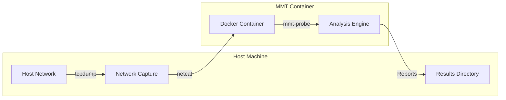

# MMT on Docker


This repository enables running Montimage Monitoring Tool (MMT) in a Docker container to simplify network traffic monitoring and analysis across different platforms.

MMT is primarily an enterprise-level network monitoring solution designed for Linux-based infrastructure environments. While MMT doesn't have native support for Windows or macOS, this Docker-based approach provides a cross-platform solution that works on any system capable of running Docker containers.

If you are a developer looking to build or modify the MMT Docker image, please see the [DEVELOPER.md](DEVELOPER.md) file.

## What is MMT?

Montimage Monitoring Tool (MMT) is a powerful enterprise-level network monitoring and analysis solution that provides:

- Real-time traffic monitoring and analysis
- Protocol identification and extraction
- Security threat detection
- Performance measurement
- Traffic statistics and visualization

MMT is designed for enterprise network infrastructures where Linux is the primary operating system. It's widely used in telecommunications, critical infrastructure monitoring, cybersecurity operations centers, and enterprise network management.

This Docker-based implementation bridges the platform gap, allowing users of Windows, macOS, and other operating systems to utilize MMT's powerful capabilities without requiring a dedicated Linux environment.

## How It Works

The following diagram illustrates how MMT on Docker captures and analyzes your network traffic:



1. **Host Network**: Your network interface that contains the traffic you want to analyze
2. **Network Capture**: tcpdump captures raw packets from your network
3. **Docker Container**: The containerized MMT environment 
4. **Analysis Engine**: MMT-probe processes and analyzes the traffic
5. **Results Directory**: Analysis reports are stored in a mounted directory on your host

## Prerequisites

Before getting started, you'll need:

- Docker installed on your system
- tcpdump and netcat utilities for capturing network traffic
- A network interface with traffic you want to analyze

## Step-by-Step Guide

### Step 1: Install Prerequisites

<details>
<summary>Click to expand installation instructions</summary>

#### Docker Installation

##### Linux
```bash
# Ubuntu/Debian
sudo apt-get update
sudo apt-get install docker.io

# Fedora/CentOS
sudo dnf install docker
sudo systemctl start docker
sudo systemctl enable docker
```

##### macOS
1. Download and install Docker Desktop from [https://www.docker.com/products/docker-desktop](https://www.docker.com/products/docker-desktop)
2. Launch Docker Desktop and follow the setup wizard

##### Windows
1. Download and install Docker Desktop from [https://www.docker.com/products/docker-desktop](https://www.docker.com/products/docker-desktop)
2. Make sure WSL 2 is installed and enabled
3. Launch Docker Desktop and follow the setup wizard

#### tcpdump and netcat Installation

##### Linux
```bash
# Ubuntu/Debian
sudo apt-get install tcpdump netcat-openbsd

# Fedora/CentOS
sudo dnf install tcpdump nc
```

##### macOS
```bash
# Using Homebrew
brew install tcpdump netcat
```

##### Windows
For Windows, you'll need either:
- [Wireshark](https://www.wireshark.org/download.html) which includes tshark
- [Nmap](https://nmap.org/download.html) which includes ncat
- Or use tcpdump and netcat within WSL (Windows Subsystem for Linux)
</details>

### Step 2: Pull the MMT Docker Image

Pull the pre-built MMT Docker image from Docker Hub:

```bash
docker pull montimage/mmt:latest
```

Alternatively, you can pull the image from GitHub Container Registry:

```bash
docker pull ghcr.io/montimage/mmt-on-x:latest
```

### Step 3: Start Network Traffic Capture

Open a terminal window and start capturing network traffic with tcpdump. Keep this terminal running.

#### For Linux:
```bash
sudo tcpdump -i eth0 -U -w - | nc -l -p 12345
```

#### For macOS:
```bash
sudo tcpdump -i en0 -U -w - | nc -l 12345
```

Replace `eth0` or `en0` with your actual network interface. To list available network interfaces:
- On Linux: `ip link show` or `ifconfig`
- On macOS: `networksetup -listallhardwareports` or `ifconfig`

#### For Windows (PowerShell with Wireshark and Nmap):
```powershell
& 'C:\Program Files\Wireshark\tshark.exe' -i Wi-Fi -w - | & 'C:\Program Files\Nmap\ncat.exe' -l 12345
```

### Step 4: Run the MMT Container

Open a new terminal window and run the MMT container:

```bash
# Create a directory for reports
mkdir -p ./mmt-reports

# Run the MMT container
docker run -d --name mmt-probe --rm \
  -v "$(pwd)/mmt-reports":/opt/mmt/probe/result/report/online \
  montimage/mmt:latest
```

This command:
- Creates a container named `mmt-probe`
- Maps a local directory `./mmt-reports` to store analysis results
- Runs the container in the background (`-d`)
- Automatically removes the container when it stops (`--rm`)

### Step 5: View the Results

The analysis reports are saved in the `mmt-reports` directory:

```bash
# List report files
ls -la ./mmt-reports
```

### Step 6: Stop the Container

When you're done monitoring, stop the container:

```bash
docker stop mmt-probe
```

Also terminate the tcpdump process in the first terminal window by pressing <kbd>Ctrl</kbd>+<kbd>C</kbd>.

## Advanced Usage

### Monitor a Specific Network Interface Directly

If you're running on Linux, you can have the MMT container directly monitor a host network interface:

```bash
docker run -d --name mmt-probe --rm \
  --net=host \
  -v "$(pwd)/mmt-reports":/opt/mmt/probe/result/report/online \
  -e HOST_INTERFACE=eth0 \
  montimage/mmt:latest
```

Replace `eth0` with your network interface name.

### Analyze a PCAP File

You can analyze a pre-recorded PCAP file using the MMT container:

```bash
# Create reports directory
mkdir -p ./mmt-reports

# Run the container with a PCAP file
docker run -d --name mmt-probe --rm \
  -v "$(pwd)/mmt-reports":/opt/mmt/probe/result/report/online \
  -v "$(pwd)/my-capture.pcap":/pcap/my-capture.pcap \
  -e PCAP_FILE=/pcap/my-capture.pcap \
  montimage/mmt:latest
```

Replace `my-capture.pcap` with your actual PCAP file name. This command:
- Mounts your PCAP file into the container
- Sets the PCAP_FILE environment variable to tell MMT to analyze this file
- Saves analysis results to the mmt-reports directory

### Using a Custom Reports Location

Specify a different directory to store reports:

```bash
docker run -d --name mmt-probe --rm \
  -v "/path/to/your/reports":/opt/mmt/probe/result/report/online \
  montimage/mmt:latest
```

### Using a Custom Container Name

```bash
docker run -d --name my-custom-mmt --rm \
  -v "$(pwd)/mmt-reports":/opt/mmt/probe/result/report/online \
  montimage/mmt:latest
```

### Using a Specific Version

```bash
docker run -d --name mmt-probe --rm \
  -v "$(pwd)/mmt-reports":/opt/mmt/probe/result/report/online \
  montimage/mmt:v1.0
```

## Troubleshooting

### No Traffic Being Captured

1. Verify your network interface name
2. Ensure tcpdump is running with sudo/administrator privileges
3. Check that port 12345 is not being used by another application
4. Verify that netcat is properly installed

### Container Exits Immediately

If the container exits immediately after starting, check:

1. Docker logs: `docker logs mmt-probe`
2. Ensure tcpdump is running before starting the container
3. Check that port 12345 is accessible to the container

### Permission Issues with Reports Directory

If you encounter permission errors with the reports directory:

```bash
# Fix permissions on the reports directory
sudo chown -R $USER:$USER ./mmt-reports
```

## Operating Modes

The container can operate in three modes:

1. **Netcat Mode (Default)**: Captures traffic from the host machine through a netcat connection on port 12345. This is the recommended mode for most users and works across all operating systems (Windows, macOS, Linux). This cross-platform approach is what makes MMT accessible beyond its native Linux environment.

2. **Host Network Interface Mode**: Available on Linux only, this mode directly captures traffic from a specified host network interface using the `--net=host` option. This mode represents the traditional deployment method for MMT in enterprise environments, offering maximum performance and direct hardware access. Use this when you need direct access to network interfaces or are running in a production Linux environment.

3. **PCAP Analysis Mode**: Analyzes a pre-recorded PCAP file from your host system. This mode is useful for analyzing previously captured traffic, forensic analysis, or testing purposes.

## Understanding MMT Reports

MMT generates several types of reports in the configured reports directory:

### Security Reports
These reports contain information about detected security events and potential threats.

### Statistics Reports
These reports provide statistical information about the monitored network traffic, including:
- Protocol distribution
- Traffic volume
- Connection statistics
- Application behavior

### Sample Commands to View Reports

View the most recent report:
```bash
ls -lt ./mmt-reports | head -n 5
```

View a specific security report:
```bash
cat ./mmt-reports/security_report_*.xml
```

## Visualizing Reports with MMT-Operator

MMT-Operator is a graphical web interface for visualizing and analyzing MMT reports. It runs on your host machine and provides dashboards, charts, and detailed analytics.

### Setting Up MMT-Operator

1. Clone and install MMT-Operator from the [official repository](https://github.com/Montimage/mmt-operator):
   ```bash
   git clone https://github.com/Montimage/mmt-operator.git
   cd mmt-operator/www
   npm install
   ```

2. Install MongoDB (required for MMT-Operator):
   ```bash
   # For macOS using Homebrew
   brew tap mongodb/brew
   brew install mongodb-community@4.4
   brew services start mongodb-community@4.4
   ```

3. Configure MMT-Operator to read the reports from your Docker container:

   Edit the `www/config.json` file to set the correct reports directory:
   ```bash
   # Navigate to the www directory
   cd mmt-operator/www
   
   # Edit the config.json file (using your preferred editor)
   vim config.json
   ```

   The most important setting is the `file_input.data_folder` array. Make sure it includes the path to where your MMT reports are stored:
   ```json
   "file_input": {
     "data_folder": [
       "/absolute/path/to/your/mmt-reports/"
     ],
     "delete_data": true,
     "nb_readers": 1
   },
   "input_mode": "file",
   ```
   
   Replace `/absolute/path/to/your/mmt-reports/` with the absolute path to your reports directory.

4. Access the MMT-Operator web interface:
   - Open your browser and navigate to `http://localhost:8080` (default port)

### Key Features of MMT-Operator

- Real-time traffic visualization
- Security event monitoring
- Protocol breakdown analysis
- Historical data examination
- Customizable dashboards

For full documentation and advanced configuration options, visit the [MMT-Operator GitHub repository](https://github.com/Montimage/mmt-operator).

## License

This project is distributed under the terms of the license covering Montimage products.

## Support and Contributing

For any issues, questions, or improvements:
- Visit [Montimage website](https://www.montimage.com)
- Contact support at support@montimage.com
