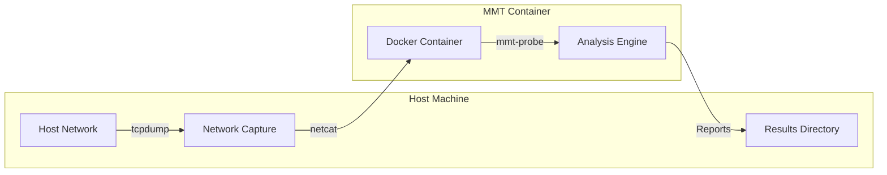

# MMT on Docker


This repository enables running Montimage Monitoring Tool (MMT) in a Docker container to simplify network traffic monitoring and analysis across different platforms.

MMT is primarily an enterprise-level network monitoring solution designed for Linux-based infrastructure environments. While MMT doesn't have native support for Windows or macOS, this Docker-based approach provides a cross-platform solution that works on any system capable of running Docker containers.

If you are a developer looking to build or modify the MMT Docker image, please see the [DEVELOPER.md](DEVELOPER.md) file.

## Table of Contents

- [MMT on Docker](#mmt-on-docker)
  - [Table of Contents](#table-of-contents)
  - [What is MMT?](#what-is-mmt)
  - [How It Works](#how-it-works)
  - [Quick Start for macOS Users](#quick-start-for-macos-users)
    - [Prerequisites for macOS](#prerequisites-for-macos)
    - [Step-by-Step Instructions for macOS](#step-by-step-instructions-for-macos)
  - [Quick Start for Windows Users](#quick-start-for-windows-users)
    - [Prerequisites for Windows](#prerequisites-for-windows)
    - [Step-by-Step Instructions for Windows](#step-by-step-instructions-for-windows)
  - [Quick Start for Linux Users](#quick-start-for-linux-users)
    - [Prerequisites for Linux](#prerequisites-for-linux)
    - [Step-by-Step Instructions for Linux](#step-by-step-instructions-for-linux)
  - [Advanced Usage](#advanced-usage)
    - [Analyzing a PCAP File](#analyzing-a-pcap-file)
    - [Using a Custom Container Name](#using-a-custom-container-name)
    - [Using a Specific Image Version](#using-a-specific-image-version)
  - [Troubleshooting](#troubleshooting)
    - [No Traffic Being Captured](#no-traffic-being-captured)
    - [Container Exits Immediately](#container-exits-immediately)
    - [Permission Issues with Reports Directory](#permission-issues-with-reports-directory)
  - [Troubleshooting](#troubleshooting-1)
    - [macOS-Specific Issues](#macos-specific-issues)
    - [Windows-Specific Issues](#windows-specific-issues)
    - [Linux-Specific Issues](#linux-specific-issues)
  - [Operating Modes](#operating-modes)
  - [Understanding MMT Reports](#understanding-mmt-reports)
    - [Security Reports](#security-reports)
    - [Statistics Reports](#statistics-reports)
    - [Sample Commands to View Reports](#sample-commands-to-view-reports)
  - [Visualizing Reports with MMT-Operator](#visualizing-reports-with-mmt-operator)
    - [Setting Up MMT-Operator](#setting-up-mmt-operator)
    - [Key Features of MMT-Operator](#key-features-of-mmt-operator)
  - [License](#license)
  - [Support and Contributing](#support-and-contributing)

## What is MMT?

Montimage Monitoring Tool (MMT) is a powerful enterprise-level network monitoring and analysis solution that provides:

- Real-time traffic monitoring and analysis
- Protocol identification and extraction
- Security threat detection
- Performance measurement
- Traffic statistics and visualization

MMT is designed for enterprise network infrastructures where Linux is the primary operating system. It's widely used in telecommunications, critical infrastructure monitoring, cybersecurity operations centers, and enterprise network management.

This Docker-based implementation bridges the platform gap, allowing users of Windows, macOS, and other operating systems to utilize MMT's powerful capabilities without requiring a dedicated Linux environment.

## How It Works

The following diagram illustrates how MMT on Docker captures and analyzes your network traffic:



1. **Host Network**: Your network interface that contains the traffic you want to analyze
2. **Network Capture**: tcpdump captures raw packets from your network
3. **Docker Container**: The containerized MMT environment 
4. **Analysis Engine**: MMT-probe processes and analyzes the traffic
5. **Results Directory**: Analysis reports are stored in a mounted directory on your host

## Quick Start for macOS Users

### Prerequisites for macOS

1. **Install Docker Desktop**:
   - Download from [Docker Desktop for Mac](https://www.docker.com/products/docker-desktop)
   - Install and launch Docker Desktop
   - Wait for Docker to start (whale icon in menu bar turns solid)

2. **Install tcpdump and netcat** using Homebrew:
   ```bash
   brew install tcpdump netcat
   ```

### Step-by-Step Instructions for macOS

1. **Pull the Docker image**:
   ```bash
   docker pull montimage/mmt:latest
   ```

2. **Find your network interface**:
   ```bash
   networksetup -listallhardwareports
   ```
   Look for your active interface (typically `en0` for Wi-Fi or `en1` for Ethernet)

3. **Start capturing network traffic** (keep this terminal window open):
   ```bash
   sudo tcpdump -i en0 -U -w - | nc -l 12345
   ```
   Replace `en0` with your actual interface name

4. **Open a new terminal window** and run the MMT container:
   ```bash
   # Create reports directory
   mkdir -p ~/mmt-reports
   
   # Run the container
   docker run -d --name mmt-probe --rm \
     -v ~/mmt-reports:/opt/mmt/probe/result/report/online \
     montimage/mmt:latest
   ```

5. **View the analysis results**:
   ```bash
   ls -la ~/mmt-reports
   ```

6. **Stop monitoring** when finished:
   ```bash
   docker stop mmt-probe
   ```
   Also press <kbd>Ctrl</kbd>+<kbd>C</kbd> in the tcpdump terminal window

## Quick Start for Windows Users

### Prerequisites for Windows

1. **Install Docker Desktop**:
   - Download from [Docker Desktop for Windows](https://www.docker.com/products/docker-desktop)
   - Ensure WSL 2 is installed and enabled ([WSL installation guide](https://docs.microsoft.com/en-us/windows/wsl/install))
   - Install and launch Docker Desktop
   - Make sure Docker is running (whale icon in system tray)

2. **Install packet capture tools**:
   - Download and install [Wireshark](https://www.wireshark.org/download.html)
   - Download and install [Nmap](https://nmap.org/download.html) (includes ncat)

### Step-by-Step Instructions for Windows

1. **Pull the Docker image**:
   ```powershell
   docker pull montimage/mmt:latest
   ```

2. **Find your network interface**:
   ```powershell
   Get-NetAdapter
   ```
   Note the name of your active network interface (e.g., "Wi-Fi" or "Ethernet")

3. **Start capturing network traffic** (keep this PowerShell window open):
   ```powershell
   & 'C:\Program Files\Wireshark\tshark.exe' -i Wi-Fi -w - | & 'C:\Program Files\Nmap\ncat.exe' -l 12345
   ```
   Replace `Wi-Fi` with your actual interface name

4. **Open a new PowerShell window** and run the MMT container:
   ```powershell
   # Create reports directory
   mkdir -p $HOME\mmt-reports

   # Run the container
   docker run -d --name mmt-probe --rm `
     -v "$HOME\mmt-reports:/opt/mmt/probe/result/report/online" `
     montimage/mmt:latest
   ```

5. **View the analysis results**:
   ```powershell
   dir $HOME\mmt-reports
   ```

6. **Stop monitoring** when finished:
   ```powershell
   docker stop mmt-probe
   ```
   Also press <kbd>Ctrl</kbd>+<kbd>C</kbd> in the packet capture window

## Quick Start for Linux Users

### Prerequisites for Linux

1. **Install Docker**:
   ```bash
   # Ubuntu/Debian
   sudo apt-get update
   sudo apt-get install docker.io
   sudo systemctl start docker
   sudo systemctl enable docker
   
   # Fedora/CentOS
   sudo dnf install docker
   sudo systemctl start docker
   sudo systemctl enable docker
   ```

2. **Install tcpdump and netcat**:
   ```bash
   # Ubuntu/Debian
   sudo apt-get install tcpdump netcat-openbsd
   
   # Fedora/CentOS
   sudo dnf install tcpdump nc
   ```

### Step-by-Step Instructions for Linux

1. **Pull the Docker image**:
   ```bash
   docker pull montimage/mmt:latest
   ```

2. **Find your network interface**:
   ```bash
   ip link show
   ```
   Note the name of your active network interface (e.g., "eth0" or "ens33")

3. **Start capturing network traffic** (keep this terminal window open):
   ```bash
   sudo tcpdump -i eth0 -U -w - | nc -l -p 12345
   ```
   Replace `eth0` with your actual interface name

4. **Open a new terminal window** and run the MMT container:
   ```bash
   # Create reports directory
   mkdir -p ~/mmt-reports
   
   # Run the container
   docker run -d --name mmt-probe --rm \
     -v ~/mmt-reports:/opt/mmt/probe/result/report/online \
     montimage/mmt:latest
   ```
   
   Alternatively, on Linux you can directly monitor a network interface:
   ```bash
   docker run -d --name mmt-probe --rm \
     --net=host -e HOST_INTERFACE=eth0 \
     -v ~/mmt-reports:/opt/mmt/probe/result/report/online \
     montimage/mmt:latest
   ```

5. **View the analysis results**:
   ```bash
   ls -la ~/mmt-reports
   ```

6. **Stop monitoring** when finished:
   ```bash
   docker stop mmt-probe
   ```
   Also press <kbd>Ctrl</kbd>+<kbd>C</kbd> in the tcpdump terminal window

## Advanced Usage

### Analyzing a PCAP File

You can analyze a pre-recorded PCAP file using the MMT container:

**macOS/Linux:**
```bash
# Create reports directory
mkdir -p ~/mmt-reports

# Run the container with a PCAP file
docker run -d --name mmt-probe --rm \
  -v ~/mmt-reports:/opt/mmt/probe/result/report/online \
  -v ~/my-capture.pcap:/pcap/my-capture.pcap \
  -e PCAP_FILE=/pcap/my-capture.pcap \
  montimage/mmt:latest
```

**Windows:**
```powershell
# Create reports directory
mkdir -p $HOME\mmt-reports

# Run the container with a PCAP file
docker run -d --name mmt-probe --rm `
  -v "$HOME\mmt-reports:/opt/mmt/probe/result/report/online" `
  -v "$HOME\my-capture.pcap:/pcap/my-capture.pcap" `
  -e PCAP_FILE=/pcap/my-capture.pcap `
  montimage/mmt:latest
```

Replace `my-capture.pcap` with your actual PCAP file name.

### Using a Custom Container Name

```bash
# For macOS/Linux
docker run -d --name my-custom-mmt --rm \
  -v ~/mmt-reports:/opt/mmt/probe/result/report/online \
  montimage/mmt:latest
```

### Using a Specific Image Version

```bash
# For macOS/Linux
docker run -d --name mmt-probe --rm \
  -v ~/mmt-reports:/opt/mmt/probe/result/report/online \
  montimage/mmt:v1.0
```

## Troubleshooting

### No Traffic Being Captured

1. Verify your network interface name
2. Ensure tcpdump is running with sudo/administrator privileges
3. Check that port 12345 is not being used by another application
4. Verify that netcat is properly installed

### Container Exits Immediately

If the container exits immediately after starting, check:

1. Docker logs: `docker logs mmt-probe`
2. Ensure tcpdump is running before starting the container
3. Check that port 12345 is accessible to the container

### Permission Issues with Reports Directory

If you encounter permission errors with the reports directory:

```bash
# Fix permissions on the reports directory
sudo chown -R $USER:$USER ./mmt-reports
```

## Troubleshooting

### macOS-Specific Issues

1. **Docker can't connect to host.docker.internal**:
   - Ensure Docker Desktop is running with the latest version
   - Try restarting Docker Desktop
   - If still failing, use a direct IP address by running:
     ```bash
     ifconfig en0 | grep "inet " | awk '{print $2}'
     ```
     Then use this IP instead of `host.docker.internal`

2. **Permission denied for tcpdump**:
   - Make sure to run tcpdump with `sudo`
   - If prompted for password multiple times, run:
     ```bash
     sudo chmod +s /usr/sbin/tcpdump
     ```

### Windows-Specific Issues

1. **Container can't reach host for packet capture**:
   - Ensure Windows Firewall allows incoming connections on port 12345
   - Try adding WSL integration in Docker Desktop settings
   - Use the IP address of your host instead of `host.docker.internal`:
     ```powershell
     ipconfig | findstr IPv4
     ```

2. **Wireshark/tshark permission issues**:
   - Run PowerShell as Administrator
   - Try using Wireshark GUI to capture to a file, then use the PCAP file analysis mode

### Linux-Specific Issues

1. **Docker permission issues**:
   - Make sure your user is in the docker group:
     ```bash
     sudo usermod -aG docker $USER
     # then logout and login again
     ```

2. **Network interface not found**:
   - Make sure you're using the correct interface name
   - For direct monitoring, ensure you use `--net=host`

## Operating Modes

The container can operate in three modes:

1. **Netcat Mode (Default)**: Captures traffic from the host machine through a netcat connection on port 12345. This is the recommended mode for most users and works across all operating systems (Windows, macOS, Linux).

2. **Host Network Interface Mode**: Available on Linux only, this mode directly captures traffic from a specified host network interface using the `--net=host` option. This mode represents the traditional deployment method for MMT in enterprise environments.

3. **PCAP Analysis Mode**: Analyzes a pre-recorded PCAP file from your host system. This mode is useful for analyzing previously captured traffic, forensic analysis, or testing purposes.

## Understanding MMT Reports

MMT generates several types of reports in the configured reports directory:

### Security Reports
These reports contain information about detected security events and potential threats.

### Statistics Reports
These reports provide statistical information about the monitored network traffic, including:
- Protocol distribution
- Traffic volume
- Connection statistics
- Application behavior

### Sample Commands to View Reports

View the most recent report:
```bash
ls -lt ./mmt-reports | head -n 5
```

View a specific security report:
```bash
cat ./mmt-reports/security_report_*.xml
```

## Visualizing Reports with MMT-Operator

MMT-Operator is a graphical web interface for visualizing and analyzing MMT reports. It runs on your host machine and provides dashboards, charts, and detailed analytics.

### Setting Up MMT-Operator

1. Clone and install MMT-Operator from the [official repository](https://github.com/Montimage/mmt-operator):
   ```bash
   git clone https://github.com/Montimage/mmt-operator.git
   cd mmt-operator/www
   npm install
   ```

2. Install MongoDB (required for MMT-Operator):
   ```bash
   # For macOS using Homebrew
   brew tap mongodb/brew
   brew install mongodb-community@4.4
   brew services start mongodb-community@4.4
   ```

3. Configure MMT-Operator to read the reports from your Docker container:

   Edit the `www/config.json` file to set the correct reports directory:
   ```bash
   # Navigate to the www directory
   cd mmt-operator/www
   
   # Edit the config.json file (using your preferred editor)
   vim config.json
   ```

   The most important setting is the `file_input.data_folder` array. Make sure it includes the path to where your MMT reports are stored:
   ```json
   "file_input": {
     "data_folder": [
       "/absolute/path/to/your/mmt-reports/"
     ],
     "delete_data": true,
     "nb_readers": 1
   },
   "input_mode": "file",
   ```
   
   Replace `/absolute/path/to/your/mmt-reports/` with the absolute path to your reports directory.

4. Access the MMT-Operator web interface:
   - Open your browser and navigate to `http://localhost:8080` (default port)

### Key Features of MMT-Operator

- Real-time traffic visualization
- Security event monitoring
- Protocol breakdown analysis
- Historical data examination
- Customizable dashboards

For full documentation and advanced configuration options, visit the [MMT-Operator GitHub repository](https://github.com/Montimage/mmt-operator).

## License

This project is distributed under the terms of the license covering Montimage products.

## Support and Contributing

For any issues, questions, or improvements:
- Visit [Montimage website](https://www.montimage.eu)
- Contact support at support@montimage.eu
