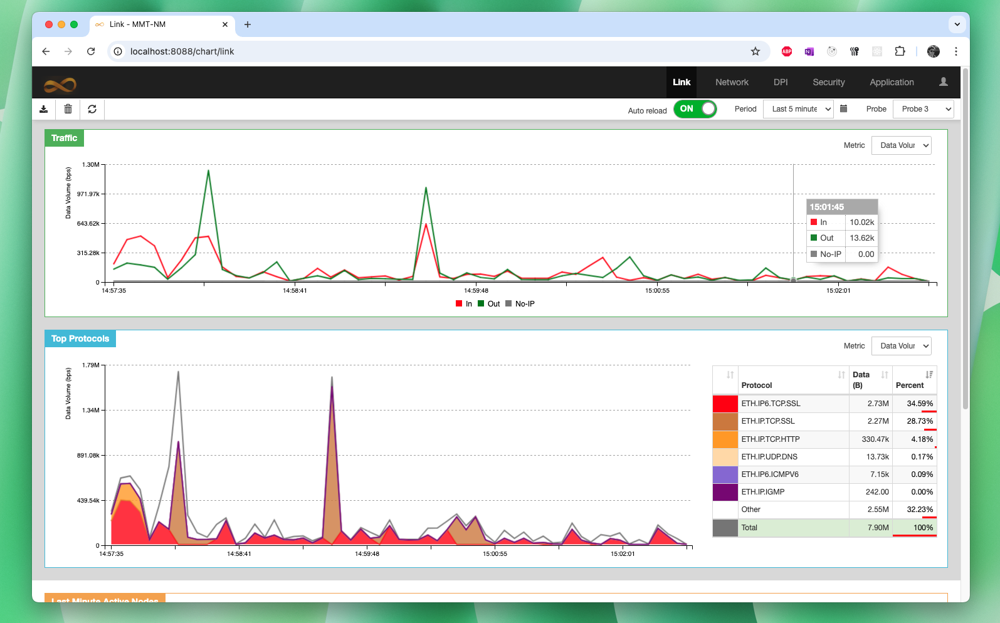
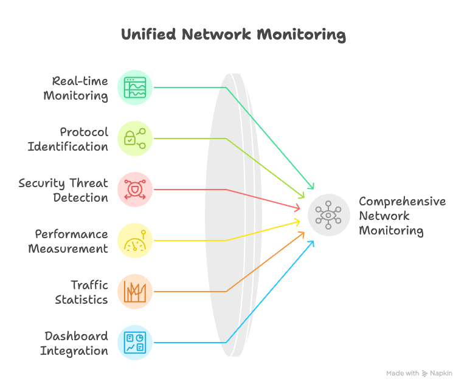
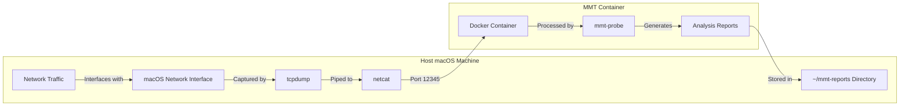

# Demystifying Your Network Traffic on macOS: A Docker-Based Approach with MMT



## The AI Analysis Paradox: Tools Without Data

In today's AI-driven world, analyzing data has never been easier. Machine learning models can detect patterns, identify anomalies, and generate insights with impressive accuracy. Yet, there's an often overlooked prerequisite to this analytical power: you need quality data first.

As a macOS user interested in cybersecurity, I've often wondered: *what exactly is happening on my network?* Which applications are sending data? Where are they connecting to? Are there suspicious connections I should be concerned about?

These questions led me to explore network traffic monitoring tools, and that's when I encountered a challenge familiar to many macOS users in the network security domain.

## Enter MMT: Enterprise-Grade Network Monitoring

[Montimage Monitoring Tool (MMT)](https://github.com/Montimage/mmt-probe) is a powerful open-source solution for network traffic monitoring and analysis. It provides:

- Real-time traffic monitoring and deep packet inspection
- Protocol identification and metadata extraction
- Security threat detection with customizable rules
- Performance measurement metrics
- Comprehensive traffic statistics and visualizations
- Integration with MMT-Operator for dashboard visualization

What sets MMT apart is its comprehensive approach—it's not just a packet sniffer or a simple analyzer. It's a complete ecosystem for network traffic monitoring, from capture to visualization, with security analysis baked in.



## The Platform Challenge

Here's the catch: MMT is primarily designed for enterprise environments where Linux is the dominant operating system. If you're running a SOC or managing network security for an organization, you're likely working with Linux servers and appliances.

But what about macOS users like myself who want to analyze their home or office network traffic? MMT doesn't offer native support for macOS, which creates a barrier to entry for Apple users who want enterprise-grade network visibility.

## The Docker Solution: MMT on macOS

This is where Docker comes to the rescue. Docker allows us to containerize applications, making them platform-agnostic and easy to deploy. Using this approach, I can now run MMT on my Mac without any complex setup or virtual machine overhead.

Today, I'll guide you through setting up and using MMT on macOS via the [mmt-on-x](https://github.com/Montimage/mmt-on-x) project—a Docker-based implementation that bridges the platform gap.

## Step-by-Step Tutorial: Network Traffic Analysis on macOS

### Prerequisites

Before we start, you'll need:

1. **Docker Desktop for Mac**:
   - Download from [Docker Desktop for Mac](https://www.docker.com/products/docker-desktop)
   - Install and launch Docker Desktop
   - Wait for Docker to start (the whale icon in your menu bar should turn solid)

2. **tcpdump and netcat**:
   ```bash
   brew install tcpdump netcat
   ```
   These tools will help us capture network traffic and pipe it to our Docker container.

### Step 1: Pull the MMT Docker Image

First, let's grab the MMT Docker image from the registry:

```bash
docker pull montimage/mmt:latest
```

This command downloads the pre-built MMT container image that contains all the necessary components.

### Step 2: Find Your Network Interface

You need to know which network interface you want to monitor. To list all available interfaces:

```bash
networksetup -listallhardwareports
```

You'll see output like:

```
Hardware Port: Wi-Fi
Device: en0
Ethernet Address: xx:xx:xx:xx:xx:xx

Hardware Port: Bluetooth PAN
Device: en2
Ethernet Address: xx:xx:xx:xx:xx:xx
```

Note your active interface name. Typically, `en0` is for Wi-Fi and `en1` for Ethernet.

### Step 3: Start Capturing Network Traffic

Open a terminal window and run:

```bash
sudo tcpdump -i en0 -U -w - | nc -l 12345
```

Replace `en0` with your actual interface name. This command:

1. Captures packets from your network interface using `tcpdump`
2. Pipes them in real-time (`-U`) to `netcat`
3. Makes them available on port 12345

*Keep this terminal window open while capturing traffic.*

### Step 4: Run the MMT Container

Open a new terminal window and run:

```bash
# Create reports directory
mkdir -p ~/mmt-reports

# Run the container
docker run -d --name mmt-probe --rm \
  -v ~/mmt-reports:/opt/mmt/probe/result/report/online \
  montimage/mmt:latest
```

This command:
- Creates a container named `mmt-probe`
- Maps a local directory `~/mmt-reports` to store analysis results
- Runs the container in the background (`-d`)
- Automatically removes the container when stopped (`--rm`)

### Step 5: View the Analysis Results

After letting MMT run for a while (capturing and analyzing your network traffic), check the generated reports:

```bash
ls -la ~/mmt-reports
```

You'll see several CSV files containing various analyses of your network traffic. For a detailed explanation of the report formats and data structure, refer to the [MMT Data Format Documentation](https://github.com/Montimage/mmt-probe/blob/master/docs/data-format.md).

### Step 6: Stop Monitoring When Finished

When you're done monitoring your network:

```bash
docker stop mmt-probe
```

Also press <kbd>Ctrl</kbd>+<kbd>C</kbd> in the tcpdump terminal window to stop the packet capture.

## What's Happening Under the Hood?

Let's break down what's happening in this setup:

1. **Packet Capture**: tcpdump is capturing raw network packets from your macOS network interface
2. **Netcat Bridge**: netcat is making these packets available on port 12345
3. **Docker Container**: The MMT container connects to this port and receives the packet stream
4. **Analysis Engine**: Inside the container, mmt-probe analyzes the traffic in real-time
5. **Report Generation**: Analysis results are stored in the mounted reports directory on your Mac

Here's a visual representation of the data flow:



This approach effectively bypasses the platform limitation, allowing MMT—which is designed for Linux—to analyze macOS network traffic.

## Taking It Further: Visualizing Your Traffic

For a more visual experience, you can set up [MMT-Operator](https://github.com/Montimage/mmt-operator), a web-based dashboard for MMT reports:

1. Clone and install MMT-Operator from the [official repository](https://github.com/Montimage/mmt-operator):
   ```bash
   git clone https://github.com/Montimage/mmt-operator.git
   cd mmt-operator/www
   npm install
   ```

2. Create a MongoDB Server - version 4.4 (required for MMT-Operator):
   ```bash
   docker run -d --name mongodb44 -p 27017:27017 mongo:4.4
   ```

3. Configure MMT-Operator to read the reports from your Docker container:

   Edit the `www/config.json` file to set the correct reports directory:
   ```bash
   # Navigate to the www directory
   cd mmt-operator/www
   
   # Edit the config.json file (using your preferred editor)
   vim config.json
   ```

   The most important setting is the `file_input.data_folder` array. Make sure it includes the path to where your MMT reports are stored:
   ```json
   "file_input": {
     "data_folder": [
       "/absolute/path/to/your/mmt-reports/"
     ],
     "delete_data": true,
     "nb_readers": 1
   },
   "input_mode": "file",
   ```
   
   Replace `/absolute/path/to/your/mmt-reports/` with the absolute path to your reports directory.

4. Start MMT-Operator: `cd mmt-operator/www && npm start`
5. Access the MMT-Operator web interface:
   - Open your browser and navigate to `http://localhost:8080` (default port)

## About Montimage and MMT-on-X

[Montimage](https://www.montimage.eu) is a company specializing in network security monitoring and analysis solutions. The MMT ecosystem (MMT-DPI, MMT-Security, MMT-Operator) provides tools for deep packet inspection, security rule verification, and traffic visualization.

The [mmt-on-x](https://github.com/Montimage/mmt-on-x) project was created to bring these powerful tools to users across different platforms, making enterprise-grade network monitoring accessible to everyone.

## Analyze Your Own Traffic Today

With this Docker-based approach, you can now:
- Monitor your home network for suspicious activity
- Understand which applications are consuming bandwidth
- Identify performance issues in your network
- Analyze protocol usage and connection patterns

All of this on your macOS machine, with no complex setup required.

---

**Disclaimer**: I work at Montimage and maintain `mmt-dpi`, the core deep packet inspection library used in MMT. This article is based on my experience using our tools in non-traditional environments and making them more accessible to the broader community.

*Have you tried monitoring your network traffic? What insights did you discover? Share your experience in the comments below!*
